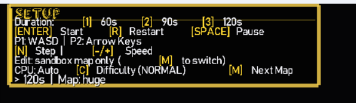
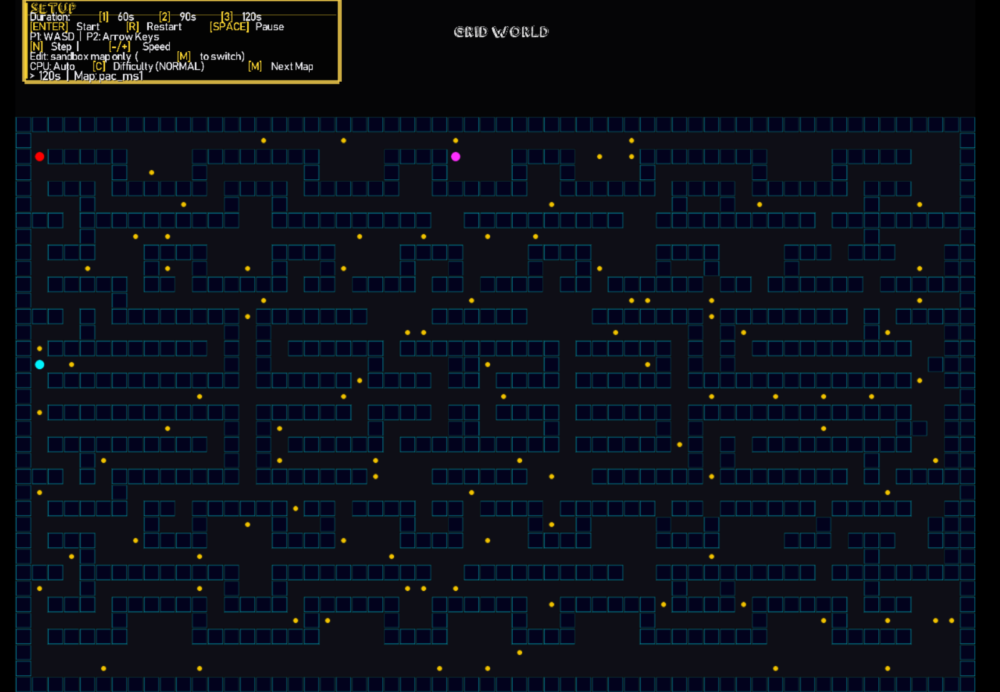
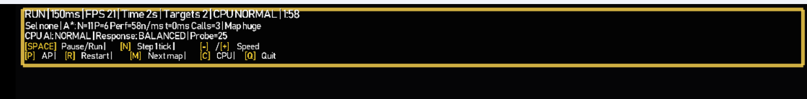
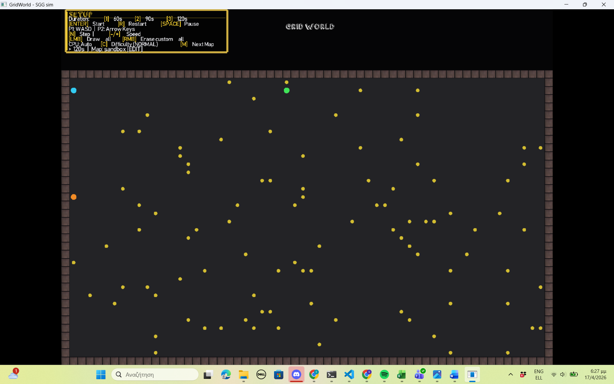
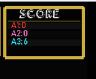
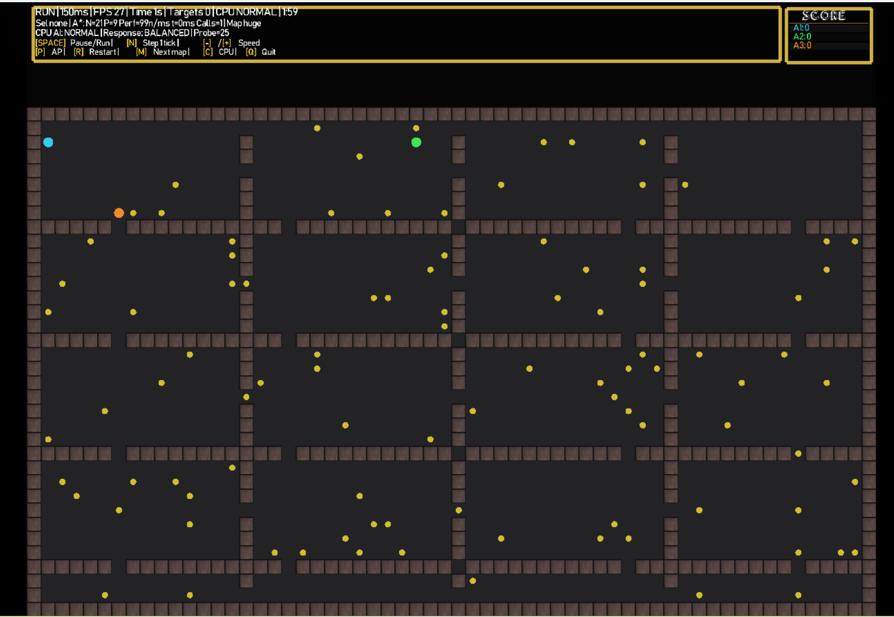
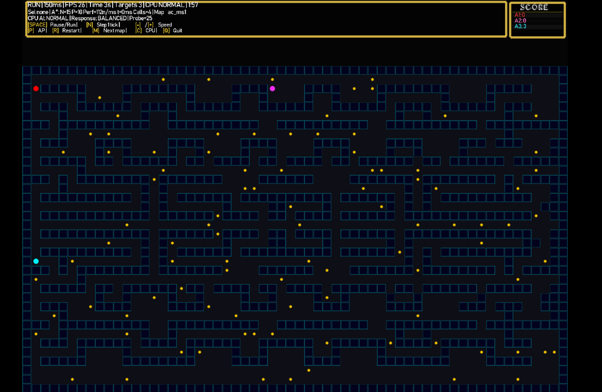
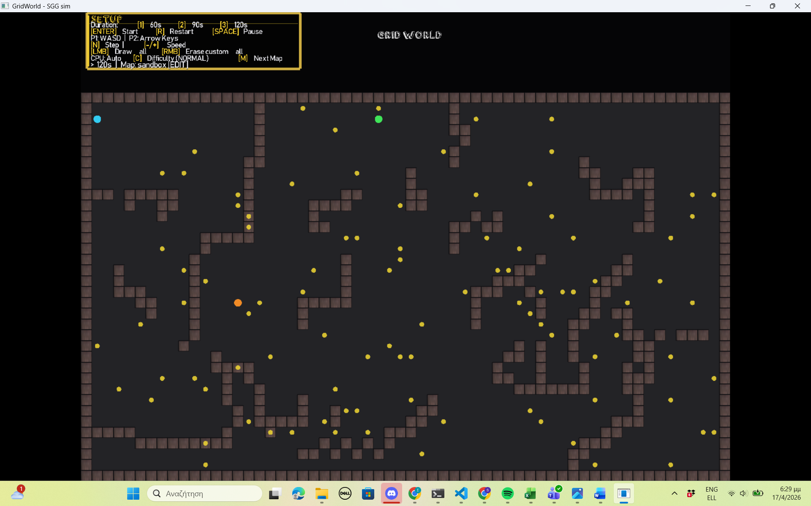
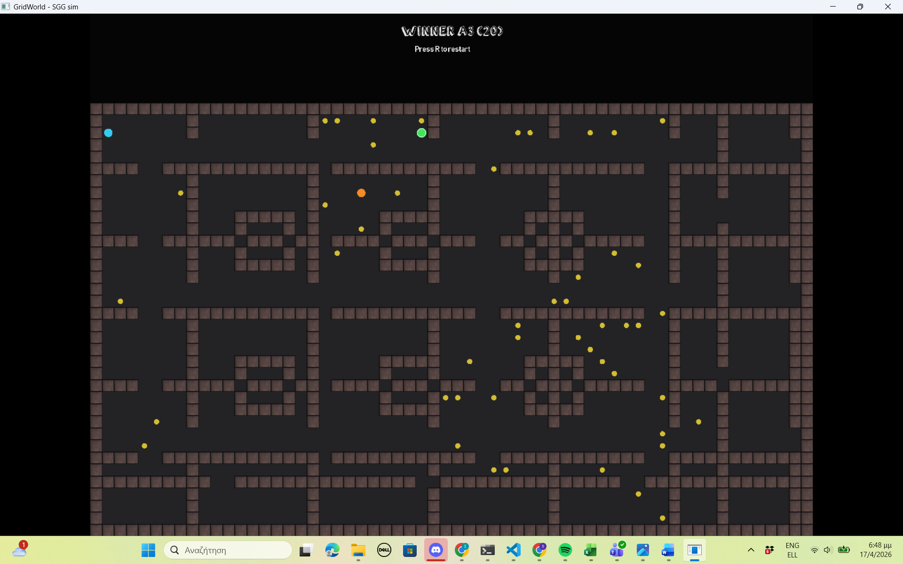
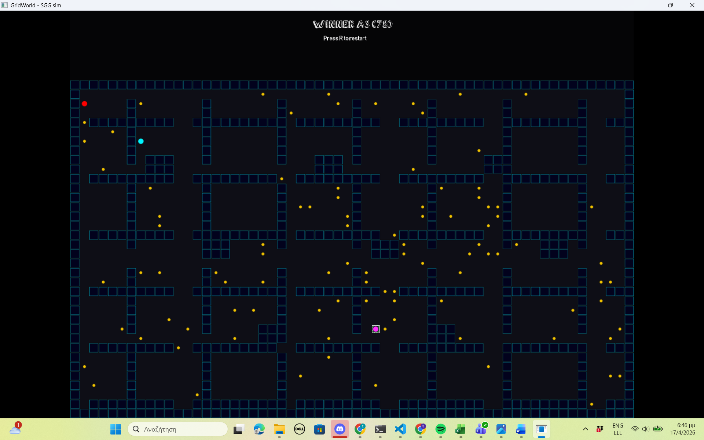

# Project

GridWorld — A* Pathfinding Simulation (C++ / SGG)

Interactive 2-player grid game with a live A* pathfinding agent.
Built as a C++17 project using the SGG graphics library and CMake.

## Video Demo

1. [Setup](recordings/setup.mp4)
2. [Sandbox Map Editor Mode](recordings/SandboxMap_EditorMode.mp4)
3. [Gameplay and Winner Reveal](recordings/GameplayAndWinnerReveal.mp4)
4. [A* Functionality and Speed Setting](recordings/Astar_funcionality&speed_setting.mp4)

## Screenshots (placeholders)

> Εδώ θα προστεθούν screenshots για κάθε βασικό κομμάτι του app.

### 1) Setup Screen
<!-- SCREENSHOT_SETUP_GR: panel "SETUP", επιλογή διάρκειας, map label -->

OG map setup:



Pacman map setup:



### 2) Main Match HUD
<!-- SCREENSHOT_HUD_GR: FPS, A* nodes/path/time, controls bar -->



OG panel (controls/details):



### 3) Score Panel
<!-- SCREENSHOT_SCORE_GR: δεξί panel με "SCORE" και agent scores -->



### 4) Live Gameplay
<!-- SCREENSHOT_GAMEPLAY_GR: agents, targets, obstacles -->

OG map gameplay:



Pacman map gameplay:



### 5) Map Editor (setup mode)
<!-- SCREENSHOT_EDITOR_GR: LMB draw wall / RMB erase wall -->



### 6) End Match Banner
<!-- SCREENSHOT_END_GR: winner/tie banner -->

OG winner:



Pacman winner:



## Τρέξιμο (SGG demo)

Οι εντολές παρακάτω τρέχουν από το root του project (τον φάκελο που έχει το `CMakeLists.txt`).

Θα χρειαστείς:
- CMake
- C++ compiler (π.χ. Visual Studio Build Tools σε Windows)
- Δεν χρειάζεται να κατεβάσεις ξεχωριστά το SGG: το repo περιέχει ήδη τον φάκελο `sgg-main/`

Το SGG θέλει εξαρτήσεις (GLEW, glm, SDL2, Freetype, SDL2_mixer). Αν λείπουν, το CMake συνήθως σκάει με μήνυμα τύπου `Could NOT find GLEW`.
Σε Windows, ο πιο απλός/σίγουρος δρόμος είναι vcpkg (υπάρχει ήδη φάκελος `vcpkg/` στο project).

### 0) vcpkg (μία φορά)

```powershell
./vcpkg/bootstrap-vcpkg.bat
./vcpkg/vcpkg.exe install glew glm sdl2 sdl2-mixer freetype --triplet x64-windows
```

Αν δεν θες να τα γράφεις κάθε φορά (install + configure + build + run), υπάρχει και script:

```powershell
powershell -ExecutionPolicy Bypass -File .\tools\run_sim_sgg.ps1
```

### 1) Configure (μία φορά)

```powershell
# Configure με vcpkg
cmake -S . -B build_sgg_vcpkg -DWITH_SGG=ON -DCMAKE_TOOLCHAIN_FILE=./vcpkg/scripts/buildsystems/vcpkg.cmake -DVCPKG_TARGET_TRIPLET=x64-windows

# Αν έχεις ήδη εγκατεστημένες τις εξαρτήσεις στο σύστημα (χωρίς vcpkg), μπορείς να δοκιμάσεις και:
# cmake -S . -B build_sgg -DWITH_SGG=ON
```

Αν έχεις ήδη έναν φάκελο `build_sgg` που είχε γίνει configure *χωρίς* vcpkg, μην προσπαθήσεις να του αλλάξεις toolchain μετά. Φτιάξε νέο build folder (π.χ. `build_sgg_vcpkg`) ή σβήσε τον παλιό.

### 2) Build

```powershell
cmake --build build_sgg_vcpkg --config Debug --target run_sim_sgg
```

### 3) Run

```powershell
.\build_sgg_vcpkg\Debug\run_sim_sgg.exe
```

### Αν "δεν τρέχει" ή δεν σε αφήνει να ξαναχτίσεις (LNK1168)

```powershell
taskkill /IM run_sim_sgg.exe /F
cmake --build build_sgg_vcpkg --config Debug --target run_sim_sgg
.\build_sgg_vcpkg\Debug\run_sim_sgg.exe
```

Αν σου βγάλει error τύπου `Error copying directory ... vcpkg/installed/$Triplet/...`, συνήθως σημαίνει ότι έχει μείνει “χαλασμένο” CMake cache. Τότε κάνε καθαρό rebuild:

```powershell
powershell -ExecutionPolicy Bypass -File .\tools\run_sim_sgg.ps1 -Reconfigure
```


## Δομή φακέλων

- `src/` : κώδικας
- `include/` : headers
- `tests/` : unit tests (απλό harness)
- `docs/requirements.md` : σύντομη σύνοψη απαιτήσεων/κάλυψης

## Χαρακτηριστικά

| Feature | Περιγραφή |
|---|---|
| A* Pathfinding | Ο CPU agent χρησιμοποιεί A* με Manhattan heuristic |
| A* Visit Callback | Κάθε βήμα του A* εκπέμπει event (`open` / `closed` / `path`) μέσω callback |
| 2-Player input | P1: WASD, P2: Arrow Keys |
| CPU Agent | Autopilot με 3 επίπεδα δυσκολίας (Easy / Normal / Hard) |
| HUD Metrics | FPS, nodes expanded, path length, search time, match timer |
| Playback controls | Play/Pause, Step-by-step (N), Speed (-/+) |
| Map Selector | `M` εναλλάσσει μεταξύ large / huge / arena_rings / symmetric_lanes / zigzag_channels / pacman_classic / pacman_crossroads maps live |
| In-app Map Editor | Μόνο στο **sandbox** map: LMB = ζωγράφισε τοίχο, RMB = σβήσε τοίχο (στο setup mode) |
| Pause freezes timer | Ο χρόνος match σταματά όταν το game είναι paused |
| N-step mode | Παίκτες κινούνται, ο CPU agent παραλείπεται |
| Unit Tests | 9 Catch2 tests για A* correctness και Map::setCell |

## Πλήκτρα (in-game)

| Πλήκτρο | Ενέργεια |
|---|---|
| `SPACE` | Pause / Resume |
| `N` | Step 1 simulation tick (παίκτες κινούνται, CPU όχι) |
| `-` / `+` | Μείωση / Αύξηση ταχύτητας |
| `ENTER` | Έναρξη match |
| `R` | Restart στο setup |
| `M` | Επόμενος χάρτης (setup only) |
| `P` | Autopilot ON/OFF για επιλεγμένο agent |
| `C` | Εναλλαγή CPU difficulty |
| `Q` / `ESC` | Έξοδος |
| `LMB` (setup) | Ζωγράφισε τοίχο στο grid (**μόνο sandbox map**) |
| `RMB` (setup) | Σβήσε τοίχο από το grid (**μόνο sandbox map**) |

## Unit Tests (Catch2)

```powershell
# Μία φορά: configure με BUILD_TESTS=ON
cmake -S . -B build_sgg_vcpkg -DWITH_SGG=ON -DBUILD_TESTS=ON `
	-DCMAKE_TOOLCHAIN_FILE=./vcpkg/scripts/buildsystems/vcpkg.cmake `
	-DVCPKG_TARGET_TRIPLET=x64-windows

# Build tests
cmake --build build_sgg_vcpkg --config Debug --target pathfinding_test

# Run
.\build_sgg_vcpkg\Debug\pathfinding_test.exe
```

Αναμενόμενο output:
```
All tests passed (43 assertions in 9 test cases)
```

---

## English Version

## Project

GridWorld — A* Pathfinding Simulation (C++ / SGG)

Interactive 2-player grid game with a live A* pathfinding agent.
Built as a C++17 project using the SGG graphics library and CMake.

## Video Demo

1. [Setup](recordings/setup.mp4)
2. [Sandbox Map Editor Mode](recordings/SandboxMap_EditorMode.mp4)
3. [Gameplay and Winner Reveal](recordings/GameplayAndWinnerReveal.mp4)
4. [A* Functionality and Speed Setting](recordings/Astar_funcionality&speed_setting.mp4)

## Screenshots (placeholders)

> Screenshots for each major app section will be added tomorrow.

### 1) Setup Screen
<!-- SCREENSHOT_SETUP_EN: "SETUP" panel, duration selector, map label -->

Setup:


### 2) Main Match HUD
<!-- SCREENSHOT_HUD_EN: FPS, A* nodes/path/time, controls bar -->


### 3) Score Panel
<!-- SCREENSHOT_SCORE_EN: right-side SCORE panel and agent scores -->


### 4) Live Gameplay
<!-- SCREENSHOT_GAMEPLAY_EN: agents, targets, obstacles -->

OG map gameplay:


Pacman map gameplay:


### 5) Map Editor (setup mode/ Sandbox)
<!-- SCREENSHOT_EDITOR_EN: LMB draw wall / RMB erase wall -->


### 6) End Match Banner
<!-- SCREENSHOT_END_EN: winner/tie banner -->

OG winner:


Pacman winner:


## Run (SGG demo)

Run the commands below from the project root (the folder that contains CMakeLists.txt).

Requirements:
- CMake
- A C++ compiler (for example, Visual Studio Build Tools on Windows)
- No separate SGG download is required: the repository already includes `sgg-main/`

SGG needs dependencies (GLEW, glm, SDL2, Freetype, SDL2_mixer).
On Windows, the easiest and most reliable path is vcpkg (the repository already includes a vcpkg/ folder).

### 0) vcpkg (one time)

```powershell
./vcpkg/bootstrap-vcpkg.bat
./vcpkg/vcpkg.exe install glew glm sdl2 sdl2-mixer freetype --triplet x64-windows
```

If you do not want to type install + configure + build + run every time, use the helper script:

```powershell
powershell -ExecutionPolicy Bypass -File .\tools\run_sim_sgg.ps1
```

### 1) Configure (one time)

```powershell
# Configure with vcpkg
cmake -S . -B build_sgg_vcpkg -DWITH_SGG=ON -DCMAKE_TOOLCHAIN_FILE=./vcpkg/scripts/buildsystems/vcpkg.cmake -DVCPKG_TARGET_TRIPLET=x64-windows

# If your system already has all dependencies (without vcpkg), you can also try:
# cmake -S . -B build_sgg -DWITH_SGG=ON
```

If you already have a build_sgg folder configured without vcpkg, do not switch toolchains in-place.
Create a new build folder (for example build_sgg_vcpkg) or delete the old one.

### 2) Build

```powershell
cmake --build build_sgg_vcpkg --config Debug --target run_sim_sgg
```

### 3) Run

```powershell
.\build_sgg_vcpkg\Debug\run_sim_sgg.exe
```

### If it does not run or rebuild fails (LNK1168)

```powershell
taskkill /IM run_sim_sgg.exe /F
cmake --build build_sgg_vcpkg --config Debug --target run_sim_sgg
.\build_sgg_vcpkg\Debug\run_sim_sgg.exe
```

If you get an error like Error copying directory ... vcpkg/installed/$Triplet/..., it usually means your CMake cache is stale.
Run a clean reconfigure:

```powershell
powershell -ExecutionPolicy Bypass -File .\tools\run_sim_sgg.ps1 -Reconfigure
```

## Folder Structure

- src/: source code
- include/: headers
- tests/: unit tests
- docs/requirements.md: short requirements/coverage summary

## Features

| Feature | Description |
|---|---|
| A* Pathfinding | CPU agent uses A* with Manhattan heuristic |
| A* Visit Callback | Each A* step emits an event (open / closed / path) via callback |
| 2-Player input | P1: WASD, P2: Arrow Keys |
| CPU Agent | Autopilot with 3 difficulty levels (Easy / Normal / Hard) |
| HUD Metrics | FPS, nodes expanded, path length, search time, match timer |
| Playback controls | Play/Pause, Step-by-step (N), Speed (-/+) |
| Map Selector | M cycles between large / huge / arena_rings / symmetric_lanes / zigzag_channels / pacman_classic / pacman_crossroads maps live |
| In-app Map Editor | **Sandbox map only**: LMB draws a wall, RMB erases a wall (setup mode) |
| Pause freezes timer | Match timer is frozen while paused |
| N-step mode | Players move, CPU agent is skipped |
| Unit Tests | 9 Catch2 tests for A* correctness and Map::setCell |

## Controls (in-game)

| Key | Action |
|---|---|
| SPACE | Pause / Resume |
| N | Step 1 simulation tick (players move, CPU does not) |
| - / + | Decrease / Increase speed |
| ENTER | Start match |
| R | Restart to setup |
| M | Next map (setup only) |
| P | Autopilot ON/OFF for selected agent |
| C | Cycle CPU difficulty |
| Q / ESC | Quit |
| LMB (setup) | Draw wall on grid (**sandbox map only**) |
| RMB (setup) | Erase wall from grid (**sandbox map only**) |

## Unit Tests (Catch2)

```powershell
# One time: configure with BUILD_TESTS=ON
cmake -S . -B build_sgg_vcpkg -DWITH_SGG=ON -DBUILD_TESTS=ON `
	-DCMAKE_TOOLCHAIN_FILE=./vcpkg/scripts/buildsystems/vcpkg.cmake `
	-DVCPKG_TARGET_TRIPLET=x64-windows

# Build tests
cmake --build build_sgg_vcpkg --config Debug --target pathfinding_test

# Run
.\build_sgg_vcpkg\Debug\pathfinding_test.exe
```

Expected output:
```
All tests passed (43 assertions in 9 test cases)
```

